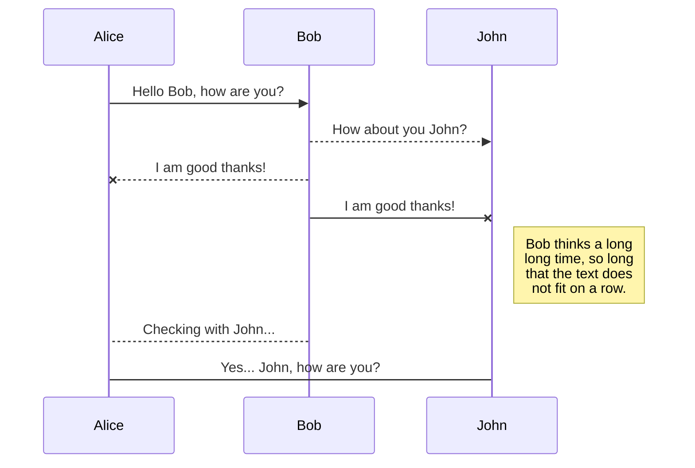
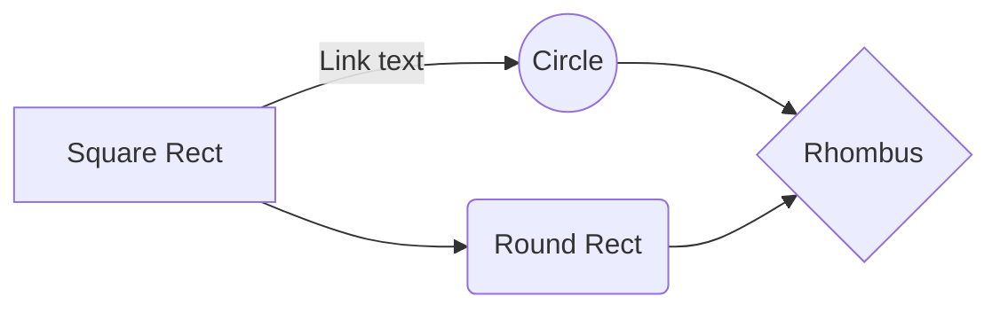

# raspbi-agent-learning

  

Join us to learn more on raspberry pi and make some apps using 
#### .NET Core 3.x
* Learn how to build and publish self hosting .NET Core app on Raspberry Pi and run it in the PI itself. 
* Learn how to run .NET Core webapi app using Nginx as reverse proxy


#### Python
* Learn how to implement some basic WebApi using .NET Core
* Learn how to implement some basic WebApi using Python

****Mari Mari MARI!!!!****

## Run a simple .NET Core web app on Raspbian
There are several ways that we can approach to run web apps or web apis' on a Raspbian OS. 
1. Self host .NET Core Web Api using Kestrel... the easy way
2. Self host .NET Core Web Api with Nginx in mind

We will try to tackle each of this

### 1. Self host .NET Core Web Api using Kestrel... the easy way
Follow the steps below
1. Create a simple .NET Core Web Api project. By right you would get a WeatherForecast service in the .NET Core Web Api project template
2. Build and publish it for linux ARM processor in release mode. We will apply self contained web app for this:
```
dotnet publish -r linux-arm --self-contained true
```
NOTE: if you set ```--self-contained false```, then you will need to use the ```dotnet <webapiname>``` to launch the app

3. Copy the ```publish``` folder generated by the ```dotnet publish``` command into Raspberry Pi. 
4. Run the web app in the Pi.

```
cd /home/pi/netcore_api_testapp
chmod +x netcore_api
./test
```

Open Chromium browser, and put in http://localhost:5000.

To automatically run our webapi app automatically you have 2 ways:
1. Run webapi app using auto start in terminal. Refer to this [link](https://stackoverflow.com/questions/36466500/on-raspberry-pi-auto-start-terminal-after-login) for more info 
2. Run webapi app using ```systemed``` functionality

** Primarily we will focus on option (2)

#### Run webapi app using ```systemed``` functionality
1. Create a file in service file
```
sudo nano /etc/systemed/system/webapi-app.service
```

add the following contents to it
```
[Unit]
Description=My Awesome .NET Core WebApi app
 
[Service]
WorkingDirectory=/home/pi/netcore_api_testapp
ExecStart=/home/pi/netcore_api_testapp/netcore_api
Restart=always
# Restart service after 10 seconds if the dotnet service crashes:
RestartSec=10
KillSignal=SIGINT
SyslogIdentifier=netcore_api
User=www-data
Environment=ASPNETCORE_ENVIRONMENT=Production
Environment=DOTNET_PRINT_TELEMETRY_MESSAGE=false
 
[Install]
WantedBy=multi-user.target
```
Save the file.

Run this command:
```
sudo systemctl enable webapi-app.service
sudo systemctl start webapi-app.service
```

Open up Chromium browser and navigate to http://localhost:5000. You can also use the commands below to ensure it is working as well
```
curl http://localhost:5000
```

and to see the server's output log for this webapi
```
journalctl -u netcore_api -f
```

### 2. Self host .NET Core Web Api with Nginx in mind
Install nginx
```
sudo apt install nginx
sudo service nginx start
```

Once installed, replace /etc/nginx/sites-available/default with:
```
server {
    listen        80;
    server_name   <your host name / public ip>;
    location / {
        proxy_pass         http://localhost:5000;
        proxy_http_version 1.1;
        proxy_set_header   Upgrade $http_upgrade;
        proxy_set_header   Connection keep-alive;
        proxy_set_header   Host $host;
        proxy_cache_bypass $http_upgrade;
        proxy_set_header   X-Forwarded-For $proxy_add_x_forwarded_for;
        proxy_set_header   X-Forwarded-Proto $scheme;
    }
}
```

Check if the default file is correct
```
sudo nginx -t
sudo nginx -s reload
```

Since we are forwarding requests from Nginx to Kestrel and vice versa, and that we have set the ```proxy_set_header``` set, we need to modify our webapi app code to match with the proxy header settings
In the ```Startup.cs``` class file, inside Configure() method, add the following code before the ```app.UseAuthentication()``` call. 
```
app.UseForwardedHeaders(new ForwardedHeadersOptions
{
    ForwardedHeaders = ForwardedHeaders.XForwardedFor | ForwardedHeaders.XForwardedProto
});
```

ensure that you publish this webapi app again as per instructions in the earlier section, copy the publish folder over to Pi, then restart the service
```
sudo systemctl restart webapi-app.service
```

In your Chromium brower navigate to http://127.0.0.1/swagger. You will find the webapi app is now howsted at port 80 behind nginx.

  
## ~~ Python Stuff goes down here

## Resources for API Server Python
 1. Tutorial for Step by steps on developing API Server Python: [Click here](https://programminghistorian.org/en/lessons/creating-apis-with-python-and-flask)

## Resources for File Transfer to Raspberry Pi
 Tutorial for Step by steps on transfering files to raspberry pi:
 - Go to ****raspberrry pi**** by typing this command in terminal :
 ```
 sudo raspi-config
```
- Select ****Option 5 (Interfacing Options)****, then choose ****P2 ( SSH)****, and ****Enable SSH Server****.
- To enable you to transfer file from your host machine to raspberry pi, you need to install ****FileZilla Client software**** to your host machine. More tuturial on how to use FileZilla for transfering files, you can [click here](https://www.dexterindustries.com/howto/how-to-transfer-files-to-your-raspberry-pi-from-a-pc-computer/#:~:text=You%20should%20see%20a%20successful,directory%20on%20the%20Raspberry%20Pi.).

  

# Files

  

StackEdit stores your files in your browser, which means all your files are automatically saved locally and are accessible ****offline!****

  

## Create files and folders

  

The file explorer is accessible using the button in left corner of the navigation bar. You can create a new file by clicking the ****New file**** button in the file explorer. You can also create folders by clicking the ****New folder**** button.

  

## Switch to another file

  

All your files and folders are presented as a tree in the file explorer. You can switch from one to another by clicking a file in the tree.

  

## Rename a file

  

You can rename the current file by clicking the file name in the navigation bar or by clicking the ****Rename**** button in the file explorer.

  

## Delete a file

  

You can delete the current file by clicking the ****Remove**** button in the file explorer. The file will be moved into the ****Trash**** folder and automatically deleted after 7 days of inactivity.

  

## Export a file

  

You can export the current file by clicking ****Export to disk**** in the menu. You can choose to export the file as plain Markdown, as HTML using a Handlebars template or as a PDF.

  

  

# Synchronization

  

Synchronization is one of the biggest features of StackEdit. It enables you to synchronize any file in your workspace with other files stored in your ****Google Drive****, your ****Dropbox**** and your ****GitHub**** accounts. This allows you to keep writing on other devices, collaborate with people you share the file with, integrate easily into your workflow... The synchronization mechanism takes place every minute in the background, downloading, merging, and uploading file modifications.

  

There are two types of synchronization and they can complement each other:

  

- The workspace synchronization will sync all your files, folders and settings automatically. This will allow you to fetch your workspace on any other device.

> _To start syncing your workspace, just sign in with Google in the menu._

  

- The file synchronization will keep one file of the workspace synced with one or multiple files in ****Google Drive****, ****Dropbox**** or ****GitHub****.

> _Before starting to sync files, you must link an account in the_ ****_Synchronize_**** _sub-menu._

  

## Open a file

  

You can open a file from ****Google Drive****, ****Dropbox**** or ****GitHub**** by opening the ****Synchronize**** sub-menu and clicking ****Open from****. Once opened in the workspace, any modification in the file will be automatically synced.

  

## Save a file

  

You can save any file of the workspace to ****Google Drive****, ****Dropbox**** or ****GitHub**** by opening the ****Synchronize**** sub-menu and clicking ****Save on****. Even if a file in the workspace is already synced, you can save it to another location. StackEdit can sync one file with multiple locations and accounts.

  

## Synchronize a file

  

Once your file is linked to a synchronized location, StackEdit will periodically synchronize it by downloading/uploading any modification. A merge will be performed if necessary and conflicts will be resolved.

  

If you just have modified your file and you want to force syncing, click the ****Synchronize now**** button in the navigation bar.

  

>  ****_Note:_**** _The_ ****_Synchronize now_**** _button is disabled if you have no file to synchronize._

  

## Manage file synchronization

  

Since one file can be synced with multiple locations, you can list and manage synchronized locations by clicking ****File synchronization**** in the ****Synchronize**** sub-menu. This allows you to list and remove synchronized locations that are linked to your file.

  

  

# Publication

  

Publishing in StackEdit makes it simple for you to publish online your files. Once you're happy with a file, you can publish it to different hosting platforms like ****Blogger****, ****Dropbox****, ****Gist****, ****GitHub****, ****Google Drive****, ****WordPress**** and ****Zendesk****. With [Handlebars templates](http://handlebarsjs.com/), you have full control over what you export.

  

> _Before starting to publish, you must link an account in the_ ****_Publish_**** _sub-menu._

  

## Publish a File

  

You can publish your file by opening the ****Publish**** sub-menu and by clicking ****Publish to****. For some locations, you can choose between the following formats:

  

- Markdown: publish the Markdown text on a website that can interpret it (****GitHub**** for instance),

- HTML: publish the file converted to HTML via a Handlebars template (on a blog for example).

  

## Update a publication

  

After publishing, StackEdit keeps your file linked to that publication which makes it easy for you to re-publish it. Once you have modified your file and you want to update your publication, click on the ****Publish now**** button in the navigation bar.

  

>  ****_Note:_**** _The_ ****_Publish now_**** _button is disabled if your file has not been published yet._

  

## Manage file publication

  

Since one file can be published to multiple locations, you can list and manage publish locations by clicking ****File publication**** in the ****Publish**** sub-menu. This allows you to list and remove publication locations that are linked to your file.

  

  

# Markdown extensions

  

StackEdit extends the standard Markdown syntax by adding extra ****Markdown extensions****, providing you with some nice features.

  

>  ****_ProTip:_**** _You can disable any_ ****_Markdown extension_**** _in the_ ****_File properties_**** _dialog._

  

  

## SmartyPants

  

SmartyPants converts ASCII punctuation characters into "smart" typographic punctuation HTML entities. For example:

  

|  |ASCII  |HTML |

|----------------|-------------------------------|-----------------------------|

|Single backticks|`'Isn't this fun?'`  |'Isn't this fun?'  |

|Quotes  |`"Isn't this fun?"`  |"Isn't this fun?"  |

|Dashes  |`-- is en-dash, --- is em-dash`|-- is en-dash, --- is em-dash|

  

  

## KaTeX

  

You can render LaTeX mathematical expressions using [KaTeX](https://khan.github.io/KaTeX/):

  

The *_Gamma function_* satisfying $\Gamma(n) = (n-1)!\quad\forall n\in\mathbb N$ is via the Euler integral

  

$$

\Gamma(z) = \int_0^\infty t^{z-1}e^{-t}dt\,.

$$

  

> _You can find more information about_ ****_LaTeX_**** _mathematical expressions_ [_here_](http://meta.math.stackexchange.com/questions/5020/mathjax-basic-tutorial-and-quick-reference)_._

  

  

## UML diagrams

  

You can render UML diagrams using [Mermaid](https://mermaidjs.github.io/). For example, this will produce a sequence diagram:

  



  

And this will produce a flow chart:

  


